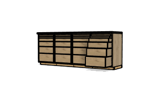
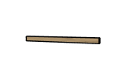
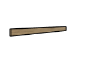
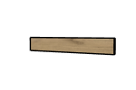
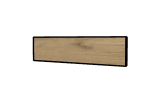
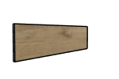
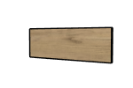
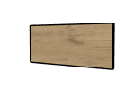
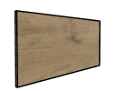
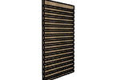

# 4 Cabinet Counter BOM

|Image|Name|Number|Description|Quantity|
|-|-|-|-|-|
||1U Dado v10:1|1U Dado|.5" x 19.25" x 1.125"|16|
||1U Rabbet v14:1|1U Rabbet|.5" x 21" x 1.125"|16|
||2U Dado v4:1|2U Dado|.5" x 19.25" x 1.125"|8|
||2U Rabbet v4:1|2U Rabbet|.5" x 21" x 1.125"|8|
||3U Dado v4:1|3U Dado|.5" x 19.25" x 1.125"|8|
||3U Rabbet v4:1|3U Rabbet|.5" x 21" x 1.125"|8|
||4U Dado v4:1|4U Dado|.5" x 19.25" x 1.125"|8|
||4U Rabbet v3:1|4U Rabbet|.5" x 21" x 1.125"|8|
||5U Dado v4:1|5U Dado|.5" x 19.25" x 1.125"|8|
||5U Rabbet v4:1|5U Rabbet|.5" x 21" x 1.125"|8|
||Drawer Bottom v13:1|Drawer Bottom|1/2" Plywood, cut piece|24|
||Drawer Stop v6:1|Drawer Stop|.75" x 23" x .5" (will be trimmed)|8|
||False Back v5:1|False Back|.5" x 21" x 1.125"|24|
||Footer Long v1:1|Footer Long||2|
||Footer Short v1:1|Footer Short||5|
||Frame Side v25:1|Frame Side|3/4" Plywood, Cut Piece|8|
||Frame Stretcher v8:1|Frame Stretcher|.75" x 19.5" x 3"|24|
||Laminate End:1|Laminate End||2|
||Laminate Front:1|Laminate Front||1|
||Laminate Top:1|Laminate Top||1|
||MDF Sheet v4:1|MDF Sheet||2|
||Pocket Hole Screw v2 v5:1|1.25" Pocket Hole Screw v2|Affiliate Link: https://amzn.to/3F6uvkX|96|