# 4 Cab Counter 35.35" Finish Height BOM
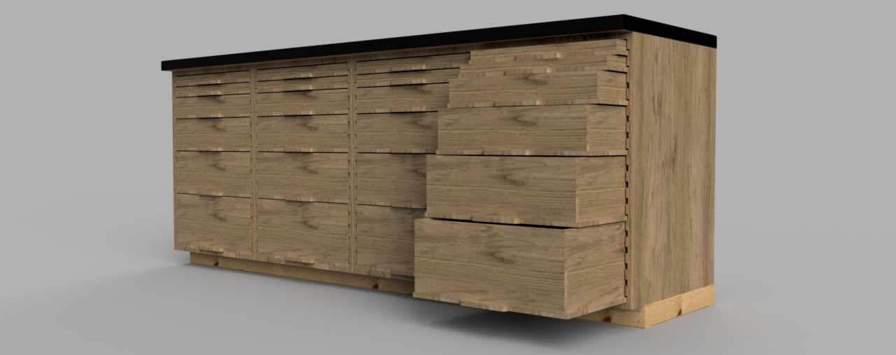
|Image|Name|Number|Description|Quantity|
|-|-|-|-|-|
||1U Drawer Dado:1|1U Drawer Dado|19 1/4" x 1 1/8" x 1/2"|8|
|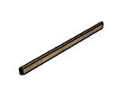|1U Drawer Rabbet:1|1U Drawer Rabbet|20 3/4" x 1 1/8" x 1/2"|8|
|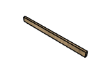|1U False Back:1|1U False Back|18 1/4" x 1 1/8" x 1/2"|4|
||2U Drawer Dado:1|2U Drawer Dado|19 1/4" x 2 7/8" x 1/2"|16|
|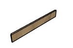|2U Drawer Rabbet:1|2U Drawer Rabbet|20 3/4" x 2 7/8" x 1/2"|16|
||2U False Back:1|2U False Back|18 1/4" x 2 7/8" x 1/2"|8|
||3U Drawer Dado:1|3U Drawer Dado|19 1/4" x 4 5/8" x 1/2"|8|
|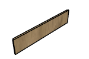|3U Drawer Rabbet:1|3U Drawer Rabbet|20 3/4" x 4 5/8" x 1/2"|8|
|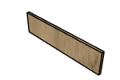|3U False Back:1|3U False Back|18 1/4" x 4 5/8" x 1/2"|4|
||4U Drawer Dado:1|4U Drawer Dado|19 1/4" x 6 3/8" x 1/2"|8|
||4U Drawer Rabbet:1|4U Drawer Rabbet|20 3/4" x 6 3/8" x 1/2"|8|
||4U False Back:1|4U False Back|18 1/4" x 6 3/8" x 1/2"|4|
|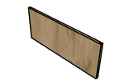|5U Drawer Dado:1|5U Drawer Dado|19 1/4" x 8 1/8" x 1/2"|8|
|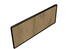|5U Drawer Rabbet:1|5U Drawer Rabbet|20 3/4" x 8 1/8" x 1/2"|8|
||5U False Back:1|5U False Back|18 1/4" x 8 1/8" x 1/2"|4|
||Drawer Bottom v25:1|Drawer Bottom|20 x 21 1/4 x 1/2|24|
|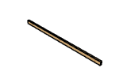|Footer Long v3:1|Footer Long|2" x 4" x 84"|2|
||Footer Short v3:1|Footer Short|2" x 4" x 16"|5|
||Frame Side 35.35" Finish Height v4:1|Frame Side 35.35" Finish Height|31 1/4" x 22" x 3/4"|8|
|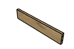|Frame Stretcher v10:1|Frame Stretcher|19 1/2" x 3 3/4" x 3/4"|24|
||Laminate End:1|Laminate End||2|
||Laminate Front:1|Laminate Front||1|
||Laminate Top:1|Laminate Top||1|
|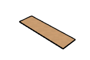|MDF Sheet v4:1|MDF Sheet||2|
||Pocket Hole Screw v2 v5:1|1.25" Pocket Hole Screw v2|Affiliate Link: https://amzn.to/3F6uvkX|96|
|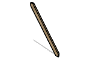|Square Brace:1|Square Brace|30 3/4" x 2 1/2" x 3/4"|4|
|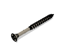|Wood Screw 2.5in v2:1|Wood Screw 2.5in|Affiliate Link: https://amzn.to/41nn14P|20|