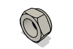
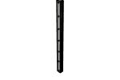
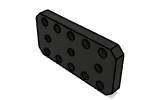
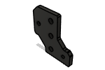
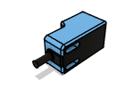

# Rat Rig Stronghold ONE CNC - 750x750 BOM

|Image|Name|Number|Description|Quantity|
|-|-|-|-|-|
||40120 Extrusion - 1000mm v2:1|40120 Extrusion - 1000mm v2||3|
||40120 Extrusion - 250mm v2:1|40120 Extrusion - 250mm v2||1|
||4040 Extrusion - 412mm v2:1|4040 Extrusion - 412mm v2||2|
||4040 Extrusion - 864mm v2:1|4040 Extrusion - 864mm v2||2|
||4040 Extrusion - 920mm v2:1|4040 Extrusion - 920mm v2||1|
||_15x30 Drag Chain Link v2:1|_15x30 Drag Chain Link v2||98|
||_750x750 Waste Board v2:1|_750x750 Waste Board v2||1|
||_Female End:1|_Female End||2|
||_Male End:1|_Male End||2|
||_MGN15C Carriage v1:1|_MGN15C Carriage v1||8|
||_SRH15 Carriage v1:1|_SRH15 Carriage v1||4|
||Aluminium Spacer - 35mm v1:1|Aluminium Spacer - 35mm v1||4|
||Aluminium Spacer - 3mm v1:1|Aluminium Spacer - 3mm v1||8|
||Aluminium Spacer - 40mm v1:1|Aluminium Spacer - 40mm v1||12|
||Ball Bearing - 688ZZ v1:1|Ball Bearing - 688ZZ v1||8|
||Bracket - Extruded 90 Degree Corner for 40 Series - 4040 - Black v1:1|Bracket - Extruded 90 Degree Corner for 40 Series - 4040 - Black v1||4|
||Cap Head Screw - Low Head - M5x16 v1:1|Cap Head Screw - Low Head - M5x16 v1||8|
||Cap Head Screw - Low Head - M8x12 v1:1|Cap Head Screw - Low Head - M8x12 v1||1|
||Cap Head Screw - Low Head - M8x30 v1:1|Cap Head Screw - Low Head - M8x30 v1||2|
||Cap Head Screw M12x45 v1:1|Cap Head Screw M12x45 v1||21|
||Cap Head Screw M3x16 v1:1|Cap Head Screw M3x16 v1||60|
||Cap Head Screw M3x20 v1:1|Cap Head Screw M3x20 v1||4|
||Cap Head Screw M3x35 v1:1|Cap Head Screw M3x35 v1||2|
||Cap Head Screw M3x8 v1:1|Cap Head Screw M3x8 v1||32|
||Cap Head Screw M4x18 v1:1|Cap Head Screw M4x18 v1||18|
||Cap Head Screw M4x20 v1:1|Cap Head Screw M4x20 v1||35|
||Cap Head Screw M5x25 v1:1|Cap Head Screw M5x25 v1||8|
||Cap Head Screw M5x50 v1:1|Cap Head Screw M5x50 v1||4|
||Cap Head Screw M5x55 v1:1|Cap Head Screw M5x55 v1||12|
||Cap Head Screw M6x12 v1:1|Cap Head Screw M6x12 v1||6|
||Cap Head Screw M6x20 v1:1|Cap Head Screw M6x20 v1||2|
||Cap Head Screw M6x70 v1:1|Cap Head Screw M6x70 v1||2|
||Cap Head Screw M8x16 v1:1|Cap Head Screw M8x16 v1||36|
||Cap Head Screw M8x22 v1:1|Cap Head Screw M8x22 v1||10|
||Cap Head Screw M8x30 v2:1|Cap Head Screw M8x30 v2||4|
||Cast 90 Degree Corner Bracket for 4040 - 8 Slot - Black v1:1|Cast 90 Degree Corner Bracket for 4040 - 8 Slot - Black v1||16|
||Countersink Screw M12x25 v1:1|Countersink Screw M12x25 v1||3|
||Countersink Screw M4x16 v1:1|Countersink Screw M4x16 v1||7|
||Coupler - Disc Type - Single 26x26mm - 5mm to 8mm - Black v1:1|Coupler - Disc Type - Single 26x26mm - 5mm to 8mm - Black v1||4|
||Hex Locking Nut - M3 v1:1|Hex Locking Nut - M3 v1||6|
||Hex Locking Nut - M4 v1:1|Hex Locking Nut - M4 v1||7|
||Hex Locking Nut - M5 v1:1|Hex Locking Nut - M5 v1||16|
||Hex Locking Nut - M8 v1:1|Hex Locking Nut - M8 v1||4|
||kress - corpo:1|kress - corpo||1|
||kress - dado:1|kress - dado||1|
||kress - Pinza:1|kress - Pinza||1|
||Lead Screw Tensioning Nut - TR8x8 v1:1|Lead Screw Tensioning Nut - TR8x8 v1||3|
||Leadscrew - TR8x8 Metric ACME Lead Screw - 1057mm v1:1|Leadscrew - TR8x8 Metric ACME Lead Screw - 1057mm v1||3|
||Leadscrew - TR8x8 Metric ACME Lead Screw - 281mm v1:1|Leadscrew - TR8x8 Metric ACME Lead Screw - 281mm v1||1|
||Linear Rail - HG15 1000mm + 2x LHGH15CA carriage v1:1|Linear Rail - HG15 1000mm + 2x LHGH15CA carriage v1||2|
||Linear Rail - MGN15 1000mm + 2 x MGN15C carriage v1:1|Linear Rail - MGN15 1000mm + 2 x MGN15C carriage v1||2|
||Linear Rail - MGN15 250mm + 2 x MGN15C carriage v2:1|Linear Rail - MGN15 250mm + 2 x MGN15C carriage v2||2|
||Lock Collar - 8mm ID v1:1|Lock Collar - 8mm ID v1||11|
||MANDRINO KRESS:1|MANDRINO KRESS||1|
||Nema 23 Stepper Motor - High Torque - 1.8deg, 345oz-in v1:1|Nema 23 Stepper Motor - High Torque - 1.8deg, 345oz-in v1||4|
||Nut Block for TR8x8 v2:1|Nut Block for TR8x8 v2||8|
||Rat Rig 40 Series Spindle Mount - Front Plate - 43mm v3:1|Rat Rig 40 Series Spindle Mount - Front Plate - 43mm v3||1|
||Rat Rig 40 Series Spindle Mount - Universal Back Plate v3:1|Rat Rig 40 Series Spindle Mount - Universal Back Plate v3||1|
||Rat Rig StrongHold CNC - Idler Plate Left 10mm:1|Rat Rig StrongHold CNC - Idler Plate Left 10mm||1|
||Rat Rig StrongHold CNC - Idler Plate Right 10mm:1|Rat Rig StrongHold CNC - Idler Plate Right 10mm||1|
||Rat Rig StrongHold CNC - Motor Plate Left 10mm:1|Rat Rig StrongHold CNC - Motor Plate Left 10mm||1|
||Rat Rig StrongHold CNC - Motor Plate Right 10mm:1|Rat Rig StrongHold CNC - Motor Plate Right 10mm||1|
||Rat Rig StrongHold CNC - XY Joiner Left 12mm:1|Rat Rig StrongHold CNC - XY Joiner Left 12mm||1|
||Rat Rig StrongHold CNC - XY Joiner Right 12mm:1|Rat Rig StrongHold CNC - XY Joiner Right 12mm||1|
||Rat Rig StrongHold CNC - XZ Joiner 8mm v2:1|Rat Rig StrongHold CNC - XZ Joiner 8mm v2||2|
||Rat Rig StrongHold CNC - Z-Axis Bottom 10mm v4:1|Rat Rig StrongHold CNC - Z-Axis Bottom 10mm v4||1|
||Rat Rig StrongHold CNC - Z-Axis Top 10mm v2:1|Rat Rig StrongHold CNC - Z-Axis Top 10mm v2||1|
||sh_dragchain_x_motor_mount v3:1|sh_dragchain_x_motor_mount v3||1|
||sh_frame_y_dragchain_mount v3:1|sh_frame_y_dragchain_mount v3||1|
||sh_gantry_y_dragchain_mount v3:1|sh_gantry_y_dragchain_mount v3||1|
||sh_xz_endstop_mount v9:1|sh_xz_endstop_mount v9||2|
||sh_y_endstop_mount v3:1|sh_y_endstop_mount v3||1|
||Shim - 12x8x1mm v1:1|Shim - 12x8x1mm v1||8|
||SN04-N2 NPN-NC Proximity Sensor v1:1|SN04-N2 NPN-NC Proximity Sensor v1||3|
|-v1.png)|Square Nut - M6 (DIN 557) v1:1|Square Nut - M6 (DIN 557) v1||2|
||T-Nut - Drop In for 4040 - M3 v1:1|T-Nut - Drop In for 4040 - M3 v1||60|
||T-Nut - Drop In for 4040 - M4 v1:1|T-Nut - Drop In for 4040 - M4 v1||35|
||T-Nut - Drop In for 4040 - M6 v1:1|T-Nut - Drop In for 4040 - M6 v1||8|
||T-Nut - Drop In for 4040 - M8 v1:1|T-Nut - Drop In for 4040 - M8 v1||46|
||Thrust Bearing F8-16M v1:1|Thrust Bearing F8-16M v1||7|
||Washer Simple M12 v1:1|Washer Simple M12 v1||21|
||Washer Simple M4 v1:1|Washer Simple M4 v1||16|
||Washer Simple M5 v1:1|Washer Simple M5 v1||8|
||Washer Simple M8 v1:1|Washer Simple M8 v1||44|