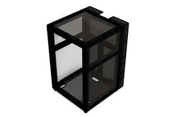

# Enclosed Frame 200 BOM

|Image|Name|Number|Description|Quantity|
|-|-|-|-|-|
||HFSB6-3030-328 v3:1|HFSB6-3030-328||6|
||HFSB6-3030-340 v2:1|HFSB6-3030-340||3|
||HFSB6-3030-340-AH170 v2:1|HFSB6-3030-340-AH170||2|
||HFSB6-3030-350 v2:1|HFSB6-3030-350||1|
||HFSB6-3030-610-LCP-RCP-AH395 v2:1|HFSB6-3030-610-LCP-RCP-AH395||2|
||HFSB6-3030-610-LCP-RCP-AH395-AV395 v2:1|HFSB6-3030-610-LCP-RCP-AH395-AV395||2|
||HTJ6 v1:1|HTJ6||28|
||HTJXL40 v1:1|HTJXL40||1|
||M3 T-Nut 3030 v2:1|M3 T-Nut 3030||28|
||M3x10 SHCS v4:1|M3x10 SHCS|Affiliate Link: https://amzn.to/45f6QX4|28|
||M6 T-Nut 3030 v3:1|M6 T-Nut 3030||48|
||M6x10 BHCS v3:1|M6x10 BHCS||48|
||Panel Back 200 v4:1|Panel Back 200||1|
||Panel Bottom 200 v1:1|Panel Bottom 200||1|
||Panel Side 200 v2:1|Panel Side 200||2|
||Panel Top 200 v2:1|Panel Top 200||1|
||Rubber foot with metal insert - Heavy Duty - 28_22_16.5mm v1:1|HW2125GC||4|
||Skirt End v5:1|Skirt End||14|