# rr-vcore-400-v4 BOM
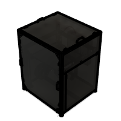
|Image|Name|Number|Description|Quantity|
|-|-|-|-|-|
||3030_end_cap v1:1|PP000179||1|
|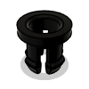|4mm Bowden Coupler v1:1|4mm Bowden Coupler v1||1|
||90940A412:1|90940A412||1|
|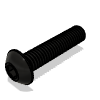|91239A118:1|91239A118||1|
|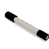|92125A138:1|92125A138||1|
|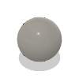|9292K74_Hard Wear-Resistant 52100 Alloy Steel Balls:1|9292K74_Hard Wear-Resistant 52100 Alloy Steel Balls||1|
|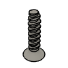|95893A403_Flat Head Thread-Forming Screws for Plastic:1|95893A403_Flat Head Thread-Forming Screws for Plastic||1|
|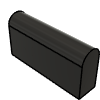|_Felt Pad - 25x25x3mm (Folded) v1:1|HW3780GC||4|
|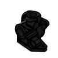|_HubHousing V5 With Logo:1|_HubHousing V5 With Logo||1|
||_Latch:1|_Latch||1|
||_LightRing v4.2 CNC:1|LightRing v4.2 CNC||1|
||_MGN12C Carriage v1:1|_MGN12C Carriage||3|
|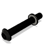|_Mounting:1|_Mounting||1|
||_MR148ZZ Ball:1|_MR148ZZ Ball||14|
|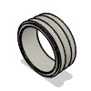|_MR148ZZ Inner Ring:1|_MR148ZZ Inner Ring||1|
|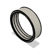|_MR148ZZ Outer Ring:1|_MR148ZZ Outer Ring||1|
|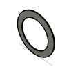|_MR148ZZ Shield1:1|_MR148ZZ Shield1||1|
||_MR148ZZ Shield2:1|_MR148ZZ Shield2||1|
|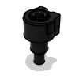|_O2 Sensor_Coupler v4.2 MJF:1|O2 Sensor_Coupler v4.2 MJF||1|
|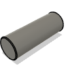|_Orbiter Spider Shaft v4:1|_Orbiter Spider Shaft v4||1|
|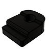|_PCBTighter v4.2 MJF:1|PCBTighter v4.2 MJF||1|
||_SRH15 Carriage v2:1|_SRH15 Carriage||3|
|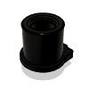|_TangleRing v4.2 MJF:1|TangleRing v4.2 MJF||1|
|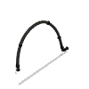|_Umbilical - CoreXY - 400 v1:1|_Umbilical - CoreXY - 400||1|
|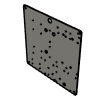|_vc4_enclosure_alu_base_v1.2 v1:1|vc4_enclosure_alu_base_v1.2||1|
|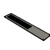|_vc4_enclosure_alu_bottom_v1.2 v1:1|vc4_enclosure_alu_bottom_v1.2||1|
|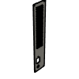|_vc4_enclosure_alu_iec_v1.2a v1:1|HW3889PC||1|
|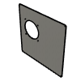|_vc4_enclosure_alu_lid_v1.2 v1:1|_vc4_enclosure_alu_lid_v1.2||1|
|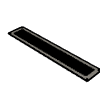|_vc4_enclosure_alu_vent_v1.2 v1:1|vc4_enclosure_alu_vent_v1.2||2|
|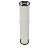|Aluminium Spacer - 3x6x30mm v2:1|HW3501NC||2|
|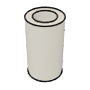|Aluminium Spacer - 5x8x14mm v1:1|HW3761NC||15|
|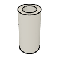|Aluminium Spacer - 5x8x17mm v1:1|HW3762NC||1|
|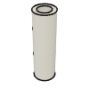|Aluminium Spacer - 5x8x27mm v1:1|HW3763NC||4|
|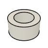|Aluminium Spacer - 5x8x4mm v1:1|HW3760NC||3|
|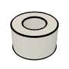|Aluminium Spacer - 6mm v2:1|HW1018NC||6|
|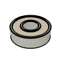|Ball Bearing - 695ZZ v1:1|HW2948WC||12|
|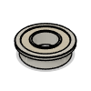|Ball Bearing - F688ZZ v1:1|HW1309WC||3|
||Ball Bearing - F695ZZ v1:1|HW2947WC||26|
|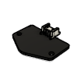|Beacon Sensor Rev H - Low Profile v1:1|HW3849EC||1|
|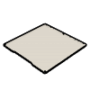|Bed Plate - 429x429x8mm v2:1|HW3728PC||1|
|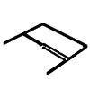|Belts - CoreXY - 400 v1:1|HW1653GC||1|
|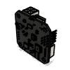|BIGTREETECH EBB42 Toolboard (Without MAX) v3:1|HW3334EC||1|
|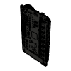|BIGTREETECH Octopus V1.1 v2:1|HW2832EC||1|
|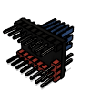|BIGTREETECH TMC2209 v1.2 v2:1|HW2052EC||8|
||Bowden Clip 1,75 v1:1|Bowden Clip 1,75 v1||1|
|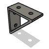|Bracket - Extruded 90 Degree Corner for 30 Series - 6030 Tall - Black v3:1|HW3162BC||5|
|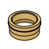|BrassCouplerRing:1|BrassCouplerRing||1|
|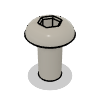|Button Head Screw M3x6 v1:1|HW1337SC||29|
|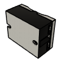|C-Lin 40A 480VAC Solid State Relay v1:1|HW1733EC||1|
|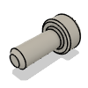|Cap Head Screw M2.5x6 v1:1|HW3775SC||4|
|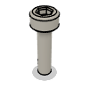|Cap Head Screw M3x12 v3:1|HW1292SC|Affiliate Link: https://amzn.to/4bs2Ze6|32|
|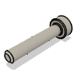|Cap Head Screw M3x16 v3:1|HW1507SC||14|
|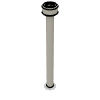|Cap Head Screw M3x35 v3:1|HW1868SC||6|
|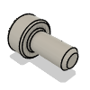|Cap Head Screw M3x6 v3:1|HW2348SC||2|
|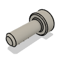|Cap Head Screw M3x8 v3:1|HW1502SC||64|
|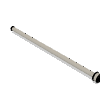|Cap Head Screw M4x100 v1:1|HW3636SC||6|
|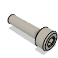|Cap Head Screw M4x16 v2:1|HW3126SC||24|
|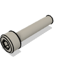|Cap Head Screw M4x20 v3:1|HW1621SC||2|
|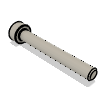|Cap Head Screw M4x30 v1:1|HW3637SC||6|
||Cap Head Screw M4x6 v3:1|HW1289SC||1|
||Cap Head Screw M4x60 v1:1|HW3635SC||6|
||Cap Head Screw M5x45 v3:1|HW2074SC||4|
||Cap Head Screw M5x8 v3:1|HW1210SC||4|
||Cap Head Screw M6x12 v3:1|HW1836SC|Affiliate Link: https://amzn.to/3EYaM70|151|
||Cap Head Screw M6x16 v3:1|HW2827SC||14|
||Cap Head Screw M8x40 v1:1|HW1871SC|Affiliate Link: https://amzn.to/3Xreo81|4|
||Clip v1:1|Clip v1||1|
||ColletClip:1|ColletClip||1|
||Component143:1|Component143||1|
||Component144:1|Component144||1|
||Component145:1|Component145||1|
||Component146:1|Component146||1|
||Component147:1|Component147||1|
||Component148:1|Component148||1|
||Component149:1|Component149||1|
||Component150:1|Component150||1|
||Component151:1|Component151||1|
||Component152:1|Component152||1|
||Component153:1|Component153||1|
||Component154:1|Component154||2|
||Component155:1|Component155||2|
||Component156:1|Component156||2|
||Component157:1|Component157||2|
||Component158:1|Component158||1|
||COMPOUND:1|COMPOUND||1|
||Countersink Screw M2.5x6 v1:1|HW3449SC||4|
||Countersink Screw M3x12 v1:1|HW1874SC||2|
||Countersink Screw M3x35 - Stainless 304 v1:1|HW3742SC||2|
||Countersink Screw M3x40 v1:1|HW3627SC||4|
||Countersink Screw M3x6 (Threadlock) v2:1|HW3899SC||4|
||Countersink Screw M3x6 v1:1|HW3414SC||37|
||Countersink Screw M4x10 v1:1|HW1876SC||2|
||Countersink Screw M4x12 v2:1|HW3259SC||2|
||Countersink Screw M4x6 v1:1|HW3777SC||4|
||Countersink Screw M5x22 v1:1|HW3638SC||2|
||Countersink Screw M5x25 v1:1|HW3772SC||3|
||Countersink Screw M5x60 v1:1|HW3634SC||8|
||Coupler - Rigid Type - Black 25x20mm - 5mm to 8mm v3:1|HW2990GC||3|
||Electronics Wire Guide Clip - Nylon v1:1|HW3847GC||21|
||Fan - 120x15 Axial - GDSTime GDA1215H24N20X25230 v1:1|HW3945EC||1|
||Fan - 4028 Axial - NIDEC W40S12BS2E5-57T04HF9 v1:1|HW3287EC||1|
||Fan - 40x10 Axial - Sunon KD2404PFB3 v3:1|HW3349EC||1|
||Fan Grille - 120mm - Black v1:1|HW3937GC||1|
||FlexPlate Set - Powder coated PEI 410x410mm v4:1|HW3928GC||1|
||FlyShaft2:1|FlyShaft2||1|
||Foam Seal - Base - 400 v1:1|HW2943GC_3||1|
||Foam Seal - Front / Rear - 400 v1:1|HW2943GC||2|
||Foam Seal - Side - 400 v1:1|HW2943GC_1||2|
||Foam Seal - Top - 400 v1:1|HW2943GC_2||1|
||Fuse Holder - EATON BK2-HTJ-608I v1:1|HW3958EC||1|
||Grommet - 18x14x7 (FIX-GR-65) v2:1|HW3783GC||1|
||Handle - Cast Alu - Black - 100mm Spacing v1:1|HW3943GC||4|
||Heat Insert - Brass - M2.5x4.6x4 v1:1|HW3776NC||4|
||Heat Insert - Brass - M3x4.6x4 v3:1|HW3224NC||108|
||Heat Insert - Brass - M4x5.8x6.3 v1:1|HW3791NC||2|
||Hex Locking Nut - M3 v2:1|HW1251NC||2|
||Hex Locking Nut - M4 v2:1|HW1374NC||4|
||Hex Locking Nut - M5 v2:1|HW1039NC||12|
||Hex Locking Nut - M6 v2:9|HW1311NC||28|
||Hex Standoff - Brass - M3x16 v1:1|HW4156NC||1|
||Hex Standoff - Steel - M3 x 35mm - Zinc Plated v1:1|HW3935NC||5|
|.png)|Housing (1) (1):1|Housing (1)||1|
||IEC Socket - Schurter 6100.3200 v1:1|HW3957EC||1|
||JST S3B-XH-A-1 PCB Connector v1:1|HW3785EC||2|
||Keenovo 380x380 1000W Silicone Heater Pad v2:1|HW2350EC||1|
||KnurledNut:1|KnurledNut||1|
||LatchShaft:1|LatchShaft||1|
||Leadscrew - TR8x4 - 475mm v1:1|HW3752SC||3|
||Leadscrew Nut - POM - TR8_4 v1:1|HW2915GC||3|
||Leveling Feet for 3030 - M8 x 30mm v1:1|HW3727GC||4|
||Linear Rail - HG15 500mm + 1x LHGH15CA carriage v3:1|HW3416GC||3|
||Linear Rail - MGN12 500mm + MGN12C carriage v1:1|HW2034GC||2|
||Linear Rail - MGN12 575mm + 2x MGN12C carriage v1:1|HW3631GC||1|
||Low Profile Screw - M3x6 v1:1|HW3917SC||2|
||Low Profile Screw - M5x30 v1:1|HW1158SC||2|
||Magnet - Neodymium disc shape - 10mm x 4mm v2:1|HW2828GC|Affiliate Link: https://amzn.to/4bFdJG9|40|
||Mini Precision Shim - 8x5x1mm v1:1|HW1630NC||13|
|-v1.png)|Molded Gear Housing (65 teeth) v1:1|Molded Gear Housing (65 teeth) v1||1|
||Nema 17 Stepper Motor - 48mm - 1.8degree, 76oz-in v1:1|HW1078EC|Affiliate Link: https://amzn.to/4bvz3Oc|3|
||Nema 17 Stepper Motor - HT - 48mm - 35mm Shaft v1:1|HW3623EC||2|
||OMRON D2HW-A201D Ultra Subminiature Switch v1:1|HW3784EC||2|
||OrbiterSmartSensor v1.1 PCB:1|OrbiterSmartSensor v1.1 PCB||1|
||PC4-M10 Bowden Pass-through Adaptor v1:1|HW3180GC||1|
||Phaetus Rapido v2 Plus UHF v2:1|HW3450EC||1|
||PTFE Filament Guide - CoreXY - 400 v4:1|HW2907GC_2||1|
||PTFE Tube - 24.5mm v1:1|HW2907GC||1|
||PTFE Tube - 87mm v1:1|HW2907GC_1||2|
||Quick Connector for 30 series B-Type - 0º v5:1|HW3347GC||28|
||RaspBerry Pi 4B v1:1|HW3790EC||1|
||Rat Rig Bi-Material Lead Screw Decoupler v1:1|HW2950WC||3|
||Rat Rig Endstop PCB - v1.1 v2:1|HW3786EC||2|
||Rat Rig PunkFil - Gooey Green - ABS Filament 1.75mm 1kg v1:1|HW3483GC||1|
||Rat Rig V-Core 4.0 - Base Plate - 400 Front v1.2:1|HW3920PC||1|
||Rat Rig V-Core 4.0 - Base Plate - 400 Rear v1.2:1|HW3921PC||1|
||Rat Rig V-Core 4.0 - Electronics AC Cover v1.0 v1:1|HW3788GC||1|
||RR Toolhead Plate - V-Core - v1.0 (Orbiter/Rapido) v2:1|HW3505PC||1|
||rr_toolhead_vc3_fan_grille v1:1|PP000252||1|
||rr_toolhead_vc4_back v2:1|PP000308||1|
||rr_toolhead_vc4_back_clamp v2:1|PP000309||2|
||rr_toolhead_vc4_duct v2:1|PP000312||1|
||rr_toolhead_vc4_front_beacon v1:1|PP000334||1|
||rr_toolhead_vc4_front_clamp v2:1|PP000315||2|
||rr_toolhead_vc4_shroud v2:1|PP000331||1|
||rr_toolhead_vc4_toolboard_vertical v2:1|PP000325||1|
||Self Tapping Screw - Fan - 12mm v1:1|HW3892SC||4|
||Set Screw M3 x 5mm v2:1|HW3499SC||1|
||Set Screw M4x16 - Dog Point - DIN915 v2:1|HW3773SC||2|
||Set Screw M4x6 - DIN913 v1:1|HW3639SC||2|
||SOLID:1|SOLID||25|
||Spring v1:1|Spring v1||1|
||SpringFusion:1|SpringFusion||1|
||Steel Ball - 12mm - Threaded M5 v2:1|HW2128GC||3|
||T-Nut - Drop In for 2020 - M3 v2:1|HW1665NC||12|
||T-Nut - Drop In for 3030 - M3 v3:1|HW1821NC||20|
||T-Nut - Drop In for 3030 - M4 v2:1|HW2774NC||24|
||T-Nut - Drop In for 3030 - M6 v3:1|HW1361NC|Affiliate Link: https://amzn.to/3D9XDY9|134|
||T-Nut - Square type for 2020 - M5 v2:1|HW1522NC||6|
||T-Slot 3030 - Black - 150mm v1:1|HW306BRC||1|
||T-Slot 3030 Milled - 540 - 2QC v1 (1):1|HW3554GC_1||1|
||T-Slot 3030 Milled - 540 - 2QC v1 (2):1|HW3554GC_2||1|
||T-Slot 3030 Milled - 540 - 2QC v1:1|HW3554GC||1|
||T-Slot 3030 Milled - 575 - 2QC - 2xM8 v2 (1):1|HW3677GC_1||1|
||T-Slot 3030 Milled - 575 - 2QC - 2xM8 v2:1|HW3677GC||1|
||T-Slot 3030 Milled - 575 - 2QC v1 (1):1|HW3676GC_1||1|
||T-Slot 3030 Milled - 575 - 2QC v1 (2):1|HW3676GC_2||1|
||T-Slot 3030 Milled - 575 - 2QC v1 (3):1|HW3676GC_3||1|
||T-Slot 3030 Milled - 575 - 2QC v1:1|HW3676GC||1|
||T-Slot 3030 Milled - 640 - 2QC v1 (1):1|HW3560GC_1||1|
||T-Slot 3030 Milled - 640 - 2QC v1 (2):1|HW3560GC_2||1|
||T-Slot 3030 Milled - 640 - 2QC v1 (3):1|HW3560GC_3||1|
||T-Slot 3030 Milled - 640 - 2QC v1 (4):1|HW3560GC_4||1|
||T-Slot 3030 Milled - 640 - 2QC v1:1|HW3560GC||1|
||T-Slot 3030 Milled - 850 - Tap - 3xM4 v1 (1):1|HW3684GC_1||1|
||T-Slot 3030 Milled - 850 - Tap - 3xM4 v1:1|HW3684GC||1|
||T-Slot 3030 Milled - 850 - Tap v1 (1):1|HW3683GC_1||1|
||T-Slot 3030 Milled - 850 - Tap v1:1|HW3683GC||1|
||T-Slot 3060 (RR Profile) - 640 - Tap v1:1|HW3688GC||1|
||T10 SpurGear:1|T10 SpurGear||1|
||Thrust Bearing F8-16M v1:1|HW2118WC|Affiliate Link: https://amzn.to/3QDMfa7|3|
||Timing Pulley - 2GT-20T - For 9mm Belt - 5mm Bore v1:1|HW1654WC||2|
||V-Core 4 Frame Magnet Holder - Nylon v2:1|HW3976GC||10|
||V-Core 4 Pillow Block - Nylon v2:1|HW3848GC||3|
||V-Slot 2020 - Black - 625mm v2:1|HW3852GC||1|
||vc4_3060_trim_diffuser:1|PP000333||4|
||vc4_3060_trim_front:1|PP000323||4|
||vc4_3060_trim_rear:1|PP000324||4|
||vc4_adapter_octopus v3:1|PP000301||2|
||vc4_adapter_rpi v1:1|PP000302||2|
||vc4_arm_cable v1:1|PP000264||1|
||vc4_arm_front v2:1|PP000265||2|
||vc4_arm_rear v3:1|PP000266||1|
||vc4_cable_guide_4 v2:1|PP000304||1|
||vc4_cable_guide_5 v2:1|PP000305||3|
||vc4_cable_guide_cross v2:1|PP000306||1|
||vc4_door_support v1:1|PP000280||2|
||vc4_electronics_1.2_corner v1:1|PP000352||4|
||vc4_grommet v2:1|PP000286||4|
||vc4_magnet_handle v2:1|PP000321||2|
||vc4_magnet_panel v1:1|PP000282||8|
||vc4_motor_spacer_left:1|PP000268||1|
||vc4_motor_spacer_right:1|PP000269||1|
||vc4_panel_door_400 v3:1|vc4_panel_door_400||1|
||vc4_panel_rear_400 v3:1|vc4_panel_rear_400||1|
||vc4_panel_side_400 v2:1|vc4_panel_side_400||2|
||vc4_panel_top_400 v3:1|vc4_panel_top_400||1|
||vc4_pom_insert_v1.0 v1:1|HW3616GC||3|
||vc4_ptfe_guide_lower v1:1|PP000285||2|
||vc4_ptfe_guide_upper v2:1|PP000284||1|
||vc4_spoolholder_arm v1:1|PP000330||1|
||vc4_tensioner_arm_v1.0 v1:1|HW3615PC||2|
||vc4_tensioner_body_left_v1.0 v1:1|HW3613PC||1|
||vc4_tensioner_body_right_v1.0 v1:1|HW3614PC||1|
||vc4_trim_corexy_left:1|PP000271||1|
||vc4_trim_corexy_right:1|PP000272||1|
||vc4_umbilical_frame v2:1|PP000283||1|
||vc4_wiper_left:1|PP000326||1|
||vc4_wiper_right:1|PP000327||1|
||vc4_wire_clip v1:1|PP000337||32|
||vc4_x_endstop v1:1|PP000273||2|
||vc4_xy_joiner_lower_v1.1 v1:1|HW3765PC||2|
||vc4_xy_joiner_middle_v1.1 v1:1|HW3766PC||2|
||vc4_xy_joiner_upper_v1.1 v1:1|HW3767PC||2|
||vc4_xy_motor_lower_left_v1.0 (1):1|HW3606PC||1|
||vc4_xy_motor_lower_right_v1.0:1|HW3607PC||1|
||vc4_xy_motor_upper_left_v1.1 (1):1|HW3769PC||1|
||vc4_xy_motor_upper_right_v1.1:1|HW3770PC||1|
||vc4_xy_spacer v2:1|PP000274||2|
||vc4_xy_trim_left:1|PP000295||1|
||vc4_xy_trim_right:1|PP000296||1|
||vc4_y_bumper v1:1|PP000277||2|
||vc4_y_endstop_mount v1:1|PP000278||1|
||vc4_z_constraint_left:1|PP000297||1|
||vc4_z_constraint_right:1|PP000298||2|
||vc4_z_limit_left:1|PP000299||1|
||vc4_z_limit_right:1|PP000300||2|
||Washer Simple M3 - Black 12.9 Steel v1:1|HW1817NC||8|
||Washer Simple M6 v3:1|HW1314NC|Affiliate Link: https://amzn.to/3FdyDQb|85|
||Weho LRS-350-24 v1:1|HW1353EC||1|