# Voron 2.4R2 BOM
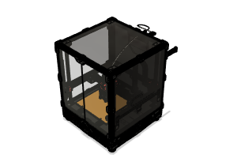
|Image|Name|Number|Description|Quantity|
|-|-|-|-|-|
||0 (20):1|0||50|
||1.75mm Filament Hinge (1):1|1.75mm Filament Hinge||1|
|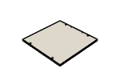|10in MIC6 Plate:1|10in MIC6 Plate||1|
||2020 Drop-in T-nut, M3 (21):1|2020 Drop-in T-nut, M3||82|
|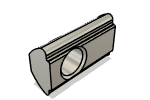|2020 Drop-in T-nut, M5 (19):1|2020 Drop-in T-nut, M5||68|
||221-415:1|221-415||3|
||250:1|250||7|
||300:1|300||7|
|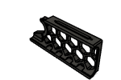|350:1|350||7|
|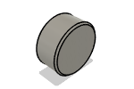|3x6mm Magnet (1):1|3x6mm Magnet||10|
||4020 Blower Fan:1|4020 Blower Fan||1|
|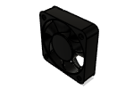|40x40x10 DC Fan:1|40x40x10 DC Fan||1|
||4x3mm PTFE Guide Tube:1|4x3mm PTFE Guide Tube||1|
||5x30 Shaft:1|5x30 Shaft||1|
||5x60 Shaft - With Flat (1):1|5x60 Shaft - With Flat||4|
|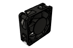|6020 Fan (3):1|6020 Fan||3|
|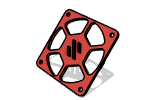|60mm_exhaust_fan_grill:1|60mm_exhaust_fan_grill||1|
|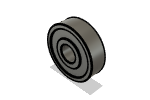|625 2RS (1):3|625 2RS||12|
|.png)|90deg Corner (OpenBuilds) (2):1|90deg Corner (OpenBuilds)||3|
|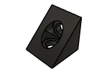|90deg Corner (OpenBuilds):1|90deg Corner||1|
||[a]_mini12864_case_front_insert (1):1|[a]_mini12864_case_front_insert||1|
||A Belt:1|A Belt||1|
|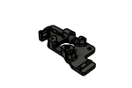|A Drive Frame Lower:1|A Drive Frame Lower||1|
||A Drive Frame Upper:1|A Drive Frame Upper||1|
|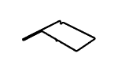|B Belt:1|B Belt||1|
||B Drive Frame Lower:1|B Drive Frame Lower||1|
||B Drive Frame Upper:1|B Drive Frame Upper||1|
||Base Plate:1|Base Plate||4|
||Bed heater:1|Bed heater||1|
|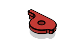|Belt Tensioner:1|Belt Tensioner||4|
|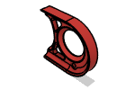|Belt_Guard (1):1|Belt_Guard||4|
|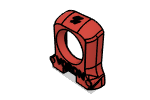|Blower Housing Front:1|Blower Housing Front||1|
||Blower Housing Rear:1|Blower Housing Rear||1|
||BMG Gear:1|BMG Gear||1|
|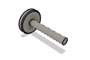|BMG Thumb Screw:1|BMG Thumb Screw||1|
||bottom_panel_clip_x4 (3):1|bottom_panel_clip_x4||4|
|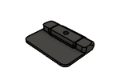|bottom_panel_hinge_x2 (1):1|bottom_panel_hinge_x2||2|
||Bowden Tube Holder:1|Bowden Tube Holder||1|
|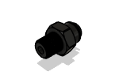|BSP Bowden Connector v1 (1):1|BSP Bowden Connector v1||1|
||BTT_Knob_Light_Shield:1|BTT_Knob_Light_Shield||1|
||c-3-1609115-3-a:1|c-3-1609115-3-a||1|
||Cable Cover:1|Cable Cover||1|
||Ceramic Cartridge Heater (1):1|Ceramic Cartridge Heater||1|
|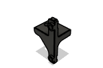|Chain Anchor 2 Hole:1|Chain Anchor 2 Hole||1|
||Chain Anchor 3 Hole:1|Chain Anchor 3 Hole||1|
||Chain Retainer Bracket:1|Chain Retainer Bracket||1|
||chain_retainer_bracket:1|chain_retainer_bracket||1|
|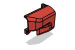|Connector cover:1|Connector cover||1|
|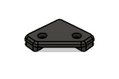|corner_clip_4mm:1|corner_clip_4mm||4|
|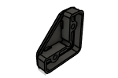|corner_clip_6mm (2):2|corner_clip_6mm||8|
||corner_panel_clip_4mm:1|corner_panel_clip_4mm||4|
|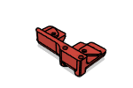|D2F_Endstop_Pod:1|D2F_Endstop_Pod||1|
||Deck Panel:1|Deck Panel||1|
||DIN Clips:1|DIN Clips||7|
|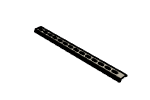|DIN3 Rail (2):1|DIN3 Rail||2|
||Direct_Drivegear:1|Direct_Drivegear||1|
||Door Handle A (1):1|Door Handle A||2|
|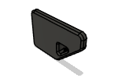|Door Handle B (1):1|Door Handle B||2|
|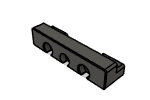|Door Latch (1):1|Door Latch||2|
||door_hinge_x6 (5):1|door_hinge_x6||6|
||Dragon Body Front:1|Dragon Body Front||1|
||Dragon Body Rear:1|Dragon Body Rear||1|
||Dragon Hotend:1|Dragon Hotend||1|
|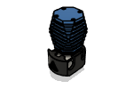|Dragonfly_BMO:1|Dragonfly_BMO||1|
||DragonflyBMO_Body_Front:1|DragonflyBMO_Body_Front||1|
|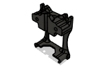|DragonflyBMO_Body_Rear:1|DragonflyBMO_Body_Rear||1|
||DragonflyBMS_Body_Front:1|DragonflyBMS_Body_Front||1|
|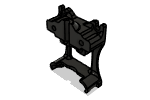|DragonflyBMS_Body_Rear:1|DragonflyBMS_Body_Rear||1|
||Duet3_Mini5 +expander:1|Duet3_Mini5 +expander||1|
|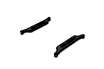|Duet3_Mini_5_+expander:1|Duet3_Mini_5_+expander||1|
||E3D Revo Micro Body Front:1|E3D Revo Micro Body Front||1|
||E3D Revo Micro Body Rear:1|E3D Revo Micro Body Rear||1|
||E3D Revo Micro:1|E3D Revo Micro||1|
|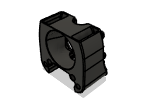|E3D V6 Body Front:1|E3D V6 Body Front||1|
|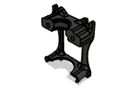|E3D V6 Body Rear:1|E3D V6 Body Rear||1|
|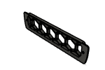|Exhaust Grill:1|Exhaust Grill||1|
|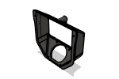|Exhaust Housing:1|Exhaust Housing||1|
||Exhaust Mount:1|Exhaust Mount||2|
||EXP MOT Bracket:1|EXP MOT Bracket||1|
||Extruder Body:1|Extruder Body||1|
||Extruder Motor Plate:1|Extruder Motor Plate||1|
||F695 ZZ (2):1|F695 ZZ||20|
||Fan Grill A:1|Fan Grill A||2|
||Fan Grill B:1|Fan Grill B||2|
||Fan Grill Retainer:1|Fan Grill Retainer||2|
||Filter Element (1):6|Filter Element||6|
||Filtered_Inlet_Skirt:1|Filtered_Inlet_Skirt||1|
|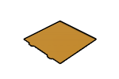|Flex Sheet:1|Flex Sheet||1|
|.png)|Foam Tape (1mm) (1):1|Foam Tape (1mm)||1|
|.png)|Foam Tape (3mm) (1):1|Foam Tape (3mm)||1|
||Foam Tape (3mm):1|Foam Tape||2|
||For_1.0mm_Mounting_Tabs:1|For_1.0mm_Mounting_Tabs||1|
||For_1.2mm_Mounting_Tabs:1|For_1.2mm_Mounting_Tabs||1|
||Front Door Left:1|Front Door Left||1|
|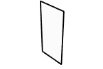|Front Door Right:1|Front Door Right||1|
|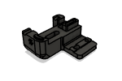|Front Idler A Bottom:1|Front Idler A Bottom||1|
||Front Idler A Top:1|Front Idler A Top||1|
|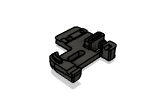|Front Idler B Bottom:1|Front Idler B Bottom||1|
|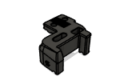|Front Idler B Top:1|Front Idler B Top||1|
||Front_Skirt_Logo:1|Front_Skirt_Logo||1|
|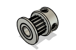|GT2 16T:1|GT2 16T||4|
||GT2 188mm Belt Loop:1|GT2 188mm Belt Loop||4|
|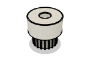|GT2 20T 6mm Deflanged:1|GT2 20T 6mm Deflanged||1|
||GT2 20T 6mm:7|GT2 20T 6mm||2|
|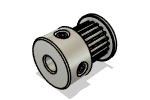|GT2 20T 9mm (2):1|GT2 20T 9mm||4|
||GT2 20T Idler (1):1|GT2 20T Idler||6|
||GT2 20T Idler 9mm (3):1|GT2 20T Idler 9mm||4|
||GT2 20T Idler Gates (1):1|GT2 20T Idler Gates||2|
||GT2 20T Idler Gates 9mm:1|GT2 20T Idler Gates 9mm||4|
|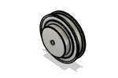|GT2 80T Pulley Powge:1|GT2 80T Pulley Powge||4|
|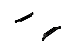|GTR Bracket:1|GTR Bracket||1|
||GTR:1|GTR||1|
|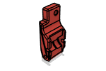|Guidler:1|Guidler||1|
||Hall Effect Endstop Pod:1|Hall Effect Endstop Pod||1|
||Heat Block:1|Heat Block||1|
|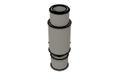|Heatbreak:1|Heatbreak||1|
|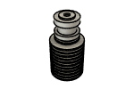|Heatsink:1|Heatsink||1|
|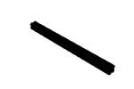|HFSB5-20-330:1|HFSB5-20-330||1|
|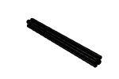|HFSB5-2020-240:1|HFSB5-2020-240||1|
||HFSB5-2020-350:1|HFSB5-2020-350||2|
||HFSB5-2020-370-TPW (1):1|HFSB5-2020-370-TPW||10|
||HFSB5-2020-430-LCP-RCP:1|HFSB5-2020-430-LCP-RCP||4|
||Hotend Fan Mount:1|Hotend Fan Mount||1|
||IEC GS Series Inlet:1|IEC GS Series Inlet||1|
|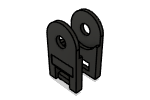|IGUS Z chain end:1|IGUS Z chain end||2|
||JST 3pin Recepticle:1|JST 3pin Recepticle||1|
||K3x5x7 Needlebearing:1|K3x5x7 Needlebearing||2|
||Keystone Blank:2|Keystone Blank||2|
||Keystone_Skirt:1|Keystone_Skirt||1|
||KW10 Microswitch:1|KW10 Microswitch||3|
||Latch Shuttle:1|Latch Shuttle||1|
||Latch:1|Latch||1|
||LCD Case Front:1|LCD Case Front||1|
||LCD Case Hinge:1|LCD Case Hinge||1|
||LCD Case Rear:1|LCD Case Rear||1|
||LRS PSU Bracket:1|LRS PSU Bracket||2|
||M2.5x10 SHCS (1):1|M2.5x10 SHCS||2|
||M2.5x8 SHCS (1):1|M2.5x8 SHCS||4|
||M2x10 Self-tapping Screw (14):1|M2x10 Self-tapping Screw||16|
||M3 Hammerhead T-Nut (11):1|M3 Hammerhead T-Nut||60|
||M3 Hex Nut:1|M3 Hex Nut||6|
||M3 Threaded Insert (108):1|M3 Threaded Insert||110|
||M3 Washer (1):1|M3 Washer||3|
||M3x10 FHCS (3):1|M3x10 FHCS||4|
||M3x12 SHCS (2):1|M3x12 SHCS||41|
||M3x16 SHCS (19):1|M3x16 SHCS||20|
||M3x20 shaft:1|M3x20 shaft||1|
||M3x20 SHCS (2):1|M3x20 SHCS||22|
||M3x30 SHCS (2):1|M3x30 SHCS||25|
||M3x40 SHCS (28):1|M3x40 SHCS||30|
||M3x6 BHCS (29):1|M3x6 BHCS||11|
||M3x6 FHCS (2):1|M3x6 FHCS||6|
||M3x8 SHCS (33):1|M3x8 SHCS||166|
||M4 Knurled Nut DIN 466-B:1|M4 Knurled Nut DIN 466-B||4|
||M4x6 BHCS:1|M4x6 BHCS||7|
||M5 1mm Shim:2|M5 1mm Shim||42|
||M5 Hex Nut (5):1|M5 Hex Nut||16|
||M5x10 BHCS (7):1|M5x10 BHCS||34|
||M5x10 BHCS :1|M5x10 BHCS ||1|
||M5x16 BHCS (7):1|M5x16 BHCS||35|
||M5x30 BHCS (2):1|M5x30 BHCS||22|
||M5x40 SHCS (3):1|M5x40 SHCS||22|
||Magnet Sheet:1|Magnet Sheet||1|
||Main Relay Body (1):1|Main Relay Body||1|
||Meanwell LRS-200-24:1|Meanwell LRS-200-24||1|
||Meanwell RS-25t:1|Meanwell RS-25t||1|
||Mech Z Endstop Assembly:1|Mech Z Endstop Assembly||1|
||MGN12 rail (1):1|MGN12 rail||1|
||MGN12H (1):1|MGN12H||1|
||MGN9 - 300mm (6):1|MGN9 - 300mm||6|
||MGN9H (2):1|MGN9H||6|
||Middle Fan Support (2):1|Middle Fan Support||2|
||midspan_clip_4mm:2|midspan_clip_4mm||4|
||midspan_clip_6mm (2):4|midspan_clip_6mm||8|
||midspan_panel_clip_4mm:1|midspan_panel_clip_4mm||3|
||Mini12864 Assembly:1|Mini12864 Assembly||1|
||Mini12864 Screen:1|Mini12864 Screen||1|
||Mosquito Body Front:1|Mosquito Body Front||1|
||Mosquito Body Rear:1|Mosquito Body Rear||1|
||Mosquito Hotend:1|Mosquito Hotend||1|
||Motorgear_17T_without_setscrew:1|Motorgear_17T_without_setscrew||1|
||MR85 Ballbearing 5x8x2:1|MR85 Ballbearing 5x8x2||2|
||NEMA17 Black (1):1|NEMA17 Black||2|
||NEMA17 Short:1|NEMA17 Short||1|
||NEMA17 Stepper:1|NEMA17 Stepper||4|
||Nozzle:1|Nozzle||1|
||Octopus Bracket:1|Octopus Bracket||1|
||Octopus v1.1:1|Octopus v1.1||1|
||Omron TL_Q5MC2:1|Omron TL_Q5MC2||1|
||Omron_D2F_F:1|Omron_D2F_F||1|
||Panasonic GX-H15A:1|Panasonic GX-H15A||1|
||Panel:1|Panel||1|
||PCB DIN Clip (1):1|PCB DIN Clip||1|
||PCB:1|PCB||1|
|.png)|PFTE insert (86mm) (1):1|PFTE insert (86mm)||1|
||PFTE insert (86mm):1|PFTE insert||1|
||Phaetus Dragonfly BMS:1|Phaetus Dragonfly BMS||1|
||probe_bracket:1|probe_bracket||1|
||probe_bracket_9mm (For Panasonic Probe):1|probe_bracket_9mm||1|
||PSU_Stabilizer:1|PSU_Stabilizer||1|
||PTFE (24mm):1|PTFE||3|
|.png)|PTFE (41mm) (1):1|PTFE (41mm)||1|
||PTFE Tube (40mm):1|PTFE Tube||2|
||Raspberry Pi (1):1|Raspberry Pi||1|
||Raspberry_Bracket:1|Raspberry_Bracket||1|
||Rear Cover (1):1|Rear Cover||1|
||Rear Panel:1|Rear Panel||1|
||RS-25 PSU Bracket (1):1|RS-25 PSU Bracket||1|
||Rubber Foot (3):1|Rubber Foot||4|
||S6 Bracket:1|S6 Bracket||1|
||S6:1|S6||1|
||Shaft-assembly:1|Shaft-assembly||1|
||Side Panel (1):1|Side Panel||2|
||SKR Bracket:1|SKR Bracket||1|
||SKR Pro Bracket:1|SKR Pro Bracket||1|
||SKR+EXPMOT:1|SKR+EXPMOT||1|
||SKR-Pro:1|SKR-Pro||1|
||SOLID:1|SOLID||4|
||Spider Bracket:1|Spider Bracket||1|
||Spider:1|Spider||1|
||Spool Holder:1|Spool Holder||1|
||Spring Assembly (1):1|Spring Assembly||1|
||Square Washer, Large (1):1|Square Washer, Large||2|
||Square Washer, Small (1):1|Square Washer, Small||2|
||SSR Mount Bracket (1):1|SSR Mount Bracket||1|
||Switch DPST:1|Switch DPST||1|
||Tensioner A:1|Tensioner A||1|
||Tensioner B:1|Tensioner B||1|
||Thermal Fuse:1|Thermal Fuse||1|
||Top Panel:1|Top Panel||1|
||VHB (27):1|VHB||12|
||VHB Mount tape (1):1|VHB Mount tape||1|
||VORONDESIGN_XY-Endstop:1|VORONDESIGN_XY-Endstop||1|
||WAGO_221-415_mount-3x5:1|WAGO_221-415_mount-3x5||1|
||x_carriage_frame_left:1|x_carriage_frame_left||1|
||x_carriage_frame_right:1|x_carriage_frame_right||1|
||XY Cable Chain Bridge - 2 Hole:1|XY Cable Chain Bridge - 2 Hole||1|
||XY Cable Chain Bridge - 3 Hole:1|XY Cable Chain Bridge - 3 Hole||1|
||XY Joint - Left:1|XY Joint - Left||1|
||XY Joint - Right:1|XY Joint - Right||1|
||Z Bearing Block Bottom (3):1|Z Bearing Block Bottom||4|
||Z Bearing Block Top HallEffect:1|Z Bearing Block Top HallEffect||1|
||Z Bearing Block Top:1|Z Bearing Block Top||3|
||Z Belt Clamp Lower (3):1|Z Belt Clamp Lower||4|
||Z Belt Clamp Upper (2):1|Z Belt Clamp Upper||4|
||Z Belt Cover A:1|Z Belt Cover A||2|
||Z Belt Cover B:1|Z Belt Cover B||2|
||Z Belt Drive A:3|Z Belt Drive A||2|
||Z Belt Drive B:2|Z Belt Drive B||2|
||Z Belt:4|Z Belt||4|
||Z Chain Lower Mount:1|Z Chain Lower Mount||1|
||Z Idler A:3|Z Idler A||2|
||Z Idler B:3|Z Idler B||2|
||Z Motor Mount:1|Z Motor Mount||4|
||Z Tensioner 6mm (3):1|Z Tensioner 6mm||4|
||Z Tensioner 9mm (3):1|Z Tensioner 9mm||4|
||Z_Chain_Guide:1|Z_Chain_Guide||1|